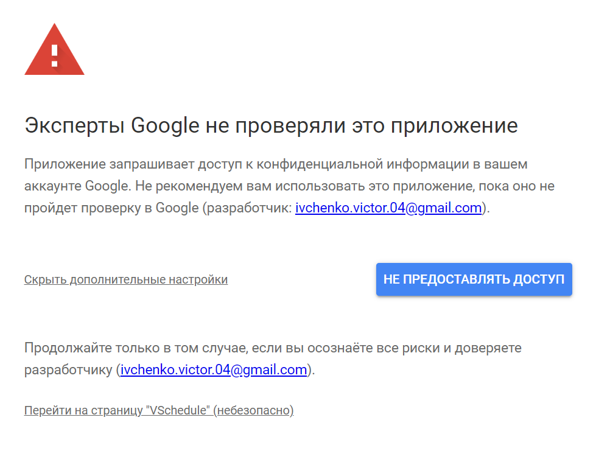

# VSchedule

Этот скрипт позволяет вам перенести свое расписание с сайта [lk.donstu.ru](https://lk.donstu.ru/) в Google Календарь.

## Начало работы

Эти инструкции позволят вам запустить скрипт для вашего аккаунта Google.

### Предварительные условия

Чтобы запустить этот скрипт, вам необходимо:

- Аккаунт Google ([создать](https://accounts.google.com/))
- Приложение Google Календарь ([установить](https://www.google.com/intl/ru/calendar/about/))

### Инициализация

> Все введенные вами данные хранятся на серверах Google, и только у вас есть к ним доступ.

1. Перейдите на [страницу скрипта](https://script.google.com/macros/s/AKfycbzd5BLZi4CFrtKlET8Or01dqDDRpCJusI54PeiUbuK9umVM8Qd5zVapjYYczv-5AzA/exec)
2. Предоставьте доступ к своему аккаунту Google
   > На данный момент скрипт не проверен Google и поэтому отображается такое окно. Нажмите "Посмотреть дополнительную информацию" -> "Перейти на страницу...".
   > 
3. Введите данные вашего аккаунта на сайте [lk.donstu.ru](https://lk.donstu.ru/)

## Проверка установки

Всего через несколько секунд в приложении отобразится новый календарь, в который будет автоматически загружено ваше расписание. (Расписание обновляется каждые 5 минут)

## Сделано с помощью

- [Google Apps Script](https://developers.google.com/apps-script) - Облачная платформа JavaScript, которая позволяет интегрировать и автоматизировать задачи в продуктах Google.

## Управление версиями

Мы используем [SemVer](http://semver.org/) для управления версиями. Доступные версии см. в разделе [теги](https://github.com/lentryd/VSchedule/tags).

## Авторы

- [lentryd](https://github.com/lentryd)

Смотрите также список [участников](https://github.com/lentryd/VSchedule/contributors), которые участвовали в этом проекте.

## Лицензия

Этот проект лицензирован по лицензии MIT - см. [LICENSE](LICENSE) файл для получения подробной информации
